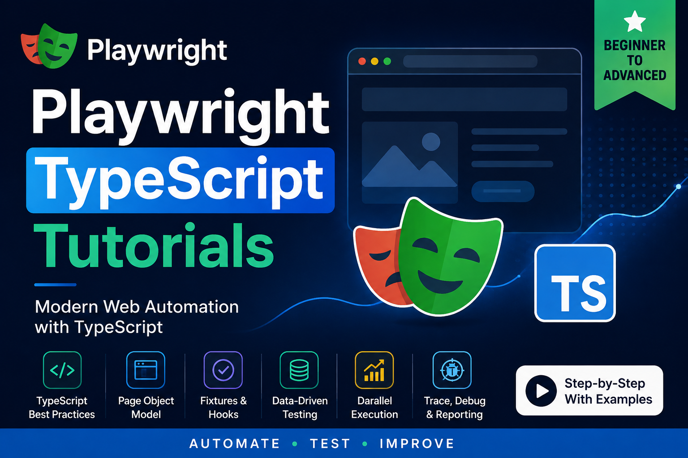

## Don't forget to give a :star: to make the project popular.

## :question: What is this Repository about?

This project contains the example code shown for performing Web Automation Testing with [Playwright TypeScript](https://playwright.dev/)

## :briefcase: What does this repo contain?
- Example Web Automation Tests with Playwright TypeScript
- This project uses the following demo applications for running tests:
    - [todomvc](https://github.com/tastejs/todomvc)
    - [live-chat-playground](https://github.com/mfaisalkhatri/live-chat-playground)
    - [Parabank Demo Application](https://parabank.parasoft.com/parabank/index.htm)
    - [LambdaTest E-Commerce Demo Playgroun](https://ecommerce-playground.lambdatest.io/)

## :hammer_and_wrench: Example Scenarios Covered 
- Setting up Playwright to run tests on multiple environments
- Browser, BrowserContext, and Page examples
- Cross Browser, Parallel Testing, Workers, and Sharding
- Network Interception
- Authentication Setup for End to End Tests

## Learning Materials
- [Playwright Browser vs BrowserContext vs Page: Complete Guide with Examples](https://medium.com/gitconnected/playwright-browser-vs-browsercontext-vs-page-complete-guide-with-examples-b6c771c8d371?sharedUserId=iamfaisalkhatri)
- [Playwright TypeScript Multiple Environments: A Complete Real-World Guide](https://medium.com/gitconnected/playwright-typescript-multiple-environments-a-complete-real-world-guide-4173bb136d68?sharedUserId=iamfaisalkhatri)
- [How to Create Custom Fixtures in Playwright TypeScript: A Complete Practical Guide](https://medium.com/gitconnected/how-to-create-custom-fixtures-in-playwright-typescript-a-complete-practical-guide-4fa8b2fc2c82?sharedUserId=iamfaisalkhatri)
- [How to use Authentication setup in Playwright TypeScript](https://medium.com/@iamfaisalkhatri/how-to-use-authentication-setup-in-playwright-typescript-f54bc68356f4?sharedUserId=iamfaisalkhatri)
- [Network Interception with Playwright TypeScript](https://medium.com/@iamfaisalkhatri/network-interception-with-playwright-typescript-0dd32195848b?sharedUserId=iamfaisalkhatri)
- [Parallel Testing in Playwright with TypeScript: A Practical Guide to Workers & Cross-Browser Testing](https://medium.com/@iamfaisalkhatri/parallel-testing-in-playwright-with-typescript-a-practical-guide-to-workers-cross-browser-testing-a407f6e7e2c2?sharedUserId=iamfaisalkhatri)

## :video_camera: Tutorial Videos

## TroubleShooting Playwright Failures

Problem | Fix
-- | --
Element not visible / click fails | page.waitForSelector(), scroll into view
File download not working | Set acceptDownloads: true in context
Font/rendering difference | Use --disable-gpu flag or screenshot diff tolerance
Viewport mismatch | Set explicit viewport: { width, height }
Auth pop-ups blocked | Handle via context.on('dialog', ...)
CI-only failures | Run with --debug locally, compare traces
Test failures | Use --debug to debug the tests for failures

## :question: Need Assistance?

- Discuss your queries by writing to me @ `mohammadfaisalkhatri@gmail.com`
  OR ping me on any of the social media sites using the below link:
   - [Linktree](https://linktr.ee/faisalkhatri)

## :computer: Paid Trainings

Contact me for Paid trainings related to Test Automation and Software Testing, 
mail me @ `mohammadfaisalkhatri@gmail.com` or ping me on [LinkedIn](https://www.linkedin.com/in/faisalkhatri/)

## :thought_balloon: Checkout tutorial blogs related to Software Testing on my 
- [Medium Blog](https://medium.com/@iamfaisalkhatri)
- [YouTube Channel](https://www.youtube.com/@faisalkhatriqa)